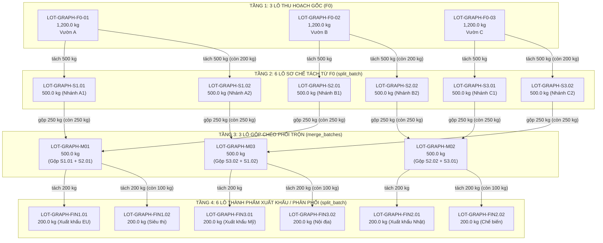

# TTCS-K18C4-N4
Dự án TTCS K18C4 - Truy xuất nguồn gốc và giám sát chuỗi lạnh nông sản

## Cấu trúc thư mục

| Thư mục | Nội dung |
| --- | --- |
| `backend/` | FastAPI + SQLite + SQLAlchemy (chi tiết xem `backend/README.md`) |
| `frontend/` | Demo giao diện: `index.html`, `css/style.css`, `js/app.js` — HTML5 + CSS + JavaScript thuần, không framework |
| `docs/` | Tài liệu dự án |

## Chạy backend

```powershell
cd backend
.\.venv\Scripts\Activate.ps1
uvicorn app.main:app --reload
```

- API: <http://127.0.0.1:8000>
- Swagger UI: <http://127.0.0.1:8000/docs>

## Chạy frontend (demo)

```powershell
cd frontend
python -m http.server 5500
```

Mở <http://127.0.0.1:5500>. Có thể mở trực tiếp `frontend/index.html`,
nhưng nên chạy qua static server để `fetch`/CORS hoạt động ổn định nhất.

Frontend gọi API tại `http://127.0.0.1:8000` (hằng số `API_BASE_URL` trong `frontend/js/app.js`).

### Đăng nhập (Sprint 4)

Mở trang → hiện **màn hình đăng nhập** (`POST /auth/login`). Tài khoản demo do
backend tạo tự động ở lần chạy đầu tiên:

| Tài khoản | Mật khẩu | Thấy được trên giao diện |
| --- | --- | --- |
| `admin` | `123456` | Toàn bộ: thẻ vùng trồng, lô nông sản **và thẻ "Tài khoản hệ thống" (`GET /users`)** |
| `farmer` | `123456` | Vùng trồng + lô nông sản (thẻ "Tài khoản hệ thống" **bị ẩn**) |

- **Không dùng JWT:** sau khi đăng nhập, frontend lưu `username`/`password` vào
  `sessionStorage` (khoá `ttcs.session`) và gửi kèm header **HTTP Basic** ở mỗi
  request cần quyền.
- Đóng tab là mất phiên (sessionStorage); bấm nút **Đăng xuất** để xoá phiên ngay.
- Backend trả **`401`** khi thiếu/sai thông tin đăng nhập và **`403`** khi đã đăng
  nhập nhưng sai vai trò (chi tiết xem `backend/README.md`, mục Sprint 4).

### CRUD & phân quyền (Sprint 5)

Sau khi đăng nhập, giao diện hiện **dashboard** gồm 3 thẻ thống kê (tổng vùng
trồng, tổng lô nông sản, tổng sản lượng kg) và 2 bảng dữ liệu có cột **Thao tác**:

| Tài khoản | Thêm | Sửa | Xoá | Quản lý tài khoản |
| --- | --- | --- | --- | --- |
| `admin` | ✅ | ✅ | ✅ | ✅ (`GET /users`) |
| `farmer` | ✅ | ✅ | ❌ **không có nút Xoá** (cố gọi API xoá → `403`) | ❌ |

- Bấm **Sửa** ở bảng → form phía trên tự điền dữ liệu và chuyển sang chế độ sửa
  (nút đổi thành **Cập nhật...**); bấm **Huỷ sửa** để quay lại chế độ thêm mới.
- Bấm **Xoá** → hộp thoại xác nhận → gọi `DELETE`. Xoá **vùng trồng** sẽ xoá kèm
  toàn bộ lô nông sản của vùng đó (backend trả về số lô bị xoá kèm để hiển thị).
- **Chưa đăng nhập:** chỉ hiện màn hình đăng nhập — dashboard, bảng dữ liệu và
  form nhập bị ẩn hoàn toàn. Bấm **Đăng xuất** → xoá phiên, xoá dữ liệu đang hiện
  và quay về màn hình đăng nhập.
- API tương ứng: `POST` / `GET` / `PUT` / `DELETE` cho `/farms` và `/batches`
  (bảng endpoint đầy đủ: xem `backend/README.md`, mục 3).

---

## Đồ thị mẫu phả hệ nông sản 4 tầng (Lineage Graph DAG - T-46 / SCRUM-62)

Hệ thống cung cấp script tự động dựng đồ thị mẫu phả hệ truy xuất nguồn gốc hoàn chỉnh sử dụng **chính hàm tách (`split_batch`)** và **hàm gộp (`merge_batches`)** của ứng dụng.

### 1. Sơ đồ đồ thị (Mermaid DAG)



### 2. Bảng dữ liệu thực tế trong CSDL

| Tầng | Mã Lô (`batch_code`) | Tên sản phẩm | Khối lượng ban đầu | Tồn kho còn lại | Nguồn gốc / Thao tác |
| :--- | :--- | :--- | :--- | :--- | :--- |
| **Tầng 1 (F0)** | `LOT-GRAPH-F0-01` | Xoài Cát Chu Thu Hoạch Vườn A | 1,200.0000 kg | 200.0000 kg | Lô thu hoạch gốc từ Thửa đất #1 |
| **Tầng 1 (F0)** | `LOT-GRAPH-F0-02` | Xoài Cát Chu Thu Hoạch Vườn B | 1,200.0000 kg | 200.0000 kg | Lô thu hoạch gốc từ Thửa đất #1 |
| **Tầng 1 (F0)** | `LOT-GRAPH-F0-03` | Xoài Cát Chu Thu Hoạch Vườn C | 1,200.0000 kg | 200.0000 kg | Lô thu hoạch gốc từ Thửa đất #1 |
| **Tầng 2 (F1)** | `LOT-GRAPH-S1.01` | Xoài Phân Loại Size 1 (Nhánh A1) | 500.0000 kg | 250.0000 kg | Tách từ F0-01 (`split_batch`) |
| **Tầng 2 (F1)** | `LOT-GRAPH-S1.02` | Xoài Phân Loại Size 2 (Nhánh A2) | 500.0000 kg | 250.0000 kg | Tách từ F0-01 (`split_batch`) |
| **Tầng 2 (F1)** | `LOT-GRAPH-S2.01` | Xoài Phân Loại Size 1 (Nhánh B1) | 500.0000 kg | 250.0000 kg | Tách từ F0-02 (`split_batch`) |
| **Tầng 2 (F1)** | `LOT-GRAPH-S2.02` | Xoài Phân Loại Size 2 (Nhánh B2) | 500.0000 kg | 250.0000 kg | Tách từ F0-02 (`split_batch`) |
| **Tầng 2 (F1)** | `LOT-GRAPH-S3.01` | Xoài Phân Loại Size 1 (Nhánh C1) | 500.0000 kg | 250.0000 kg | Tách từ F0-03 (`split_batch`) |
| **Tầng 2 (F1)** | `LOT-GRAPH-S3.02` | Xoài Phân Loại Size 2 (Nhánh C2) | 500.0000 kg | 250.0000 kg | Tách từ F0-03 (`split_batch`) |
| **Tầng 3 (F2)** | `LOT-GRAPH-M01` | Xoài Phối Trộn Đóng Thùng Lô M1 | 500.0000 kg | 100.0000 kg | Gộp chéo S1.01 (250 kg) + S2.01 (250 kg) (`merge_batches`) |
| **Tầng 3 (F2)** | `LOT-GRAPH-M02` | Xoài Phối Trộn Đóng Thùng Lô M2 | 500.0000 kg | 100.0000 kg | Gộp chéo S2.02 (250 kg) + S3.01 (250 kg) (`merge_batches`) |
| **Tầng 3 (F2)** | `LOT-GRAPH-M03` | Xoài Phối Trộn Đóng Thùng Lô M3 | 500.0000 kg | 100.0000 kg | Gộp chéo S3.02 (250 kg) + S1.02 (250 kg) (`merge_batches`) |
| **Tầng 4 (F3)** | `LOT-GRAPH-FIN1.01` | Xoài Thành Phẩm Chuẩn Xuất Khẩu EU (M1.01) | 200.0000 kg | 200.0000 kg | Tách từ M01 (`split_batch`) |
| **Tầng 4 (F3)** | `LOT-GRAPH-FIN1.02` | Xoài Thành Phẩm Chuẩn Siêu Thị (M1.02) | 200.0000 kg | 200.0000 kg | Tách từ M01 (`split_batch`) |
| **Tầng 4 (F3)** | `LOT-GRAPH-FIN2.01` | Xoài Thành Phẩm Chuẩn Xuất Khẩu Nhật (M2.01) | 200.0000 kg | 200.0000 kg | Tách từ M02 (`split_batch`) |
| **Tầng 4 (F3)** | `LOT-GRAPH-FIN2.02` | Xoài Thành Phẩm Chuẩn Chế Biến (M2.02) | 200.0000 kg | 200.0000 kg | Tách từ M02 (`split_batch`) |
| **Tầng 4 (F3)** | `LOT-GRAPH-FIN3.01` | Xoài Thành Phẩm Chuẩn Xuất Khẩu Mỹ (M3.01) | 200.0000 kg | 200.0000 kg | Tách từ M03 (`split_batch`) |
| **Tầng 4 (F3)** | `LOT-GRAPH-FIN3.02` | Xoài Thành Phẩm Chuẩn Nội Địa (M3.02) | 200.0000 kg | 200.0000 kg | Tách từ M03 (`split_batch`) |

### 3. Cách chạy Script dựng đồ thị

Mở PowerShell tại thư mục `backend/`:

```powershell
cd backend
.\.venv\Scripts\python.exe scripts/seed_lineage_graph.py
```

- **Tính Idempotent:** Tự động dọn dẹp các lô `LOT-GRAPH-*` cũ trước khi tạo lại. Chạy nhiều lần liên tiếp luôn cho kết quả nhất quán 100%.
- **Bảo mật môi trường:** Tự động kiểm tra `APP_ENV`. Bị chặn ngay lập tức nếu `APP_ENV=production` hoặc `IS_PRODUCTION=true`.

