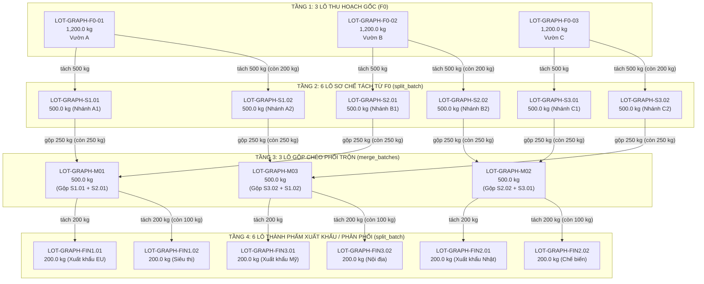

# Backend - TTCS K18C4

Backend API cho đề tài **"Truy xuất nguồn gốc và giám sát chuỗi lạnh nông sản"**.

- **Framework:** Python + FastAPI
- **Database:** SQLite (file local, không cần cài server)
- **ORM:** SQLAlchemy 2.0
- **Sprint 1 (nền tảng):** cấu hình FastAPI, kết nối SQLite, endpoint kiểm tra
  hệ thống `GET /health`.
- **Sprint 2:** module **Farm** — quản lý vùng trồng (`POST /farms`, `GET /farms`).
- **Sprint 3:** module **Batch** — quản lý lô nông sản (`POST /batches`,
  `GET /batches`, `GET /batches/{batch_id}`).
  Quan hệ dữ liệu: `Farm 1 ---- N Batch`.
- **Sprint 4:** **đăng nhập + phân quyền cơ bản** — bảng `users`, `POST /auth/login`,
  `GET /users` (chỉ admin) và dependency `require_admin` / `require_farmer`.
  *Không dùng JWT*: API cần quyền xác thực bằng **HTTP Basic**
  (Swagger UI có sẵn nút **Authorize**).
- **Sprint 5 (đang làm):** hoàn thiện **CRUD đầy đủ** — bổ sung `PUT` / `DELETE`
  cho `/farms` và `/batches` (xoá **chỉ dành cho `admin`**) kèm schema
  `FarmUpdate`/`BatchUpdate`/`DeleteResponse`; frontend ẩn/hiện theo trạng thái
  đăng nhập, thêm cột **Thao tác** (Sửa/Xoá) và dashboard thống kê
  (tổng vùng trồng, tổng lô nông sản, tổng sản lượng).
  *Chưa có* QR code, blockchain hay nghiệp vụ chuỗi lạnh.

---

## 1. Cấu trúc thư mục

```
backend/
├── app/
│   ├── __init__.py          # Đánh dấu package + khai báo __version__
│   ├── main.py              # Khởi tạo FastAPI, CORS, lifespan, đăng ký router
│   ├── database.py          # Engine SQLite, SessionLocal, Base, get_db, init_db
│   ├── models.py            # ORM models: Farm → "farms", Batch → "batches",
│   │                        #             User → "users"
│   ├── schemas.py           # Pydantic: Health / Farm / Batch / Auth
│   │                        #   (Create + Update + Response + DeleteResponse)
│   ├── security.py          # Băm mật khẩu + xác thực/phân quyền (Sprint 4)
│   └── routers/
│       ├── __init__.py      # Export các router
│       ├── health.py        # GET /health
│       ├── auth.py          # POST /auth/login (Sprint 4)
│       ├── users.py         # GET /users - chỉ admin (Sprint 4)
│       ├── farms.py         # CRUD /farms: POST, GET, PUT {id}, DELETE {id} (Sprint 5)
│       └── batches.py       # CRUD /batches: POST, GET, GET {id}, PUT {id}, DELETE {id}
├── requirements.txt         # Danh sách thư viện Python
├── .gitignore               # Bỏ qua file DB, __pycache__, .venv...
└── README.md                # Tài liệu này
```

> File `ttcs.db` (SQLite) sẽ được **tự sinh** trong thư mục `backend/` ở lần
> chạy đầu tiên — không cần commit file này lên Git.

---

## 2. Cách chạy

### Bước 1 — Tạo môi trường ảo (khuyến nghị)

Mở PowerShell tại thư mục `backend/`:

```powershell
cd backend
python -m venv .venv
.\.venv\Scripts\Activate.ps1
```

> Nếu PowerShell báo lỗi `Activate.ps1 cannot be loaded`, chạy trước:
> `Set-ExecutionPolicy -Scope CurrentUser RemoteSigned`
> (hoặc dùng `cmd`: `.venv\Scripts\activate.bat`)

### Bước 2 — Cài thư viện

```powershell
pip install -r requirements.txt
```

### Bước 3 — Chạy server

```powershell
uvicorn app.main:app --reload
```

> Bắt buộc chạy lệnh ở **thư mục `backend/`** vì code dùng absolute import
> dạng `from app.database import ...`.

Server mặc định: <http://127.0.0.1:8000>

### Bước 4 — Kiểm tra

| Mục | Địa chỉ |
| --- | --- |
| Health check | <http://127.0.0.1:8000/health> |
| Swagger UI | <http://127.0.0.1:8000/docs> |
| ReDoc | <http://127.0.0.1:8000/redoc> |

Kiểm tra nhanh bằng `curl`:

```powershell
curl.exe http://127.0.0.1:8000/health
```

Kết quả mong đợi:

```json
{ "status": "running" }
```

Hoặc chạy không cần bật sẵn server (dùng TestClient của FastAPI):

```powershell
pip install httpx
python -c "from fastapi.testclient import TestClient; from app.main import app; c = TestClient(app); print(c.get('/health').status_code, c.get('/health').json())"
```

Kết quả mong đợi: `200 {'status': 'running'}`

### Bước 5 — Đăng nhập (Sprint 4)

Tài khoản demo được tạo tự động ở lần chạy đầu tiên:

| Tài khoản | Mật khẩu | Vai trò |
| --- | --- | --- |
| `admin` | `123456` | admin (toàn quyền, xem được `GET /users`) |
| `farmer` | `123456` | farmer (quản lý vùng trồng + lô nông sản) |

Kiểm tra nhanh bằng `curl.exe`:

```powershell
# Đăng nhập đúng -> 200 + {"username":"admin","role":"admin"}
curl.exe --% -s -X POST http://127.0.0.1:8000/auth/login -H "Content-Type: application/json" -d "{\"username\":\"admin\",\"password\":\"123456\"}"

# Không gửi thông tin đăng nhập -> 401 (GET /farms nay cần quyền)
curl.exe -s -o NUL -w "%{http_code}`n" http://127.0.0.1:8000/farms

# Gửi kèm Basic auth -> 200
curl.exe -s -u admin:123456 http://127.0.0.1:8000/farms
```

> Sau khi đăng nhập ở bước này, mở <http://127.0.0.1:8000/docs> và bấm nút
> **Authorize** để test các API cần quyền ngay trên Swagger UI.
>
> **Sprint 5 — quyền xoá dữ liệu:** chỉ tài khoản **`admin`** gọi được
> `DELETE /farms/{id}` và `DELETE /batches/{id}`. Tài khoản `farmer` vẫn
> thêm/sửa dữ liệu nông sản nhưng sẽ nhận **`403 Forbidden`** khi xoá, và trên
> giao diện frontend thì **nút Xoá không hiện** với farmer.

---

## 3. API hiện có

| Method | Endpoint | Mô tả | Quyền | Mã trả về |
| --- | --- | --- | --- | --- |
| GET | `/health` | Kiểm tra hệ thống đang chạy | công khai | `200` |
| POST | `/auth/login` | Kiểm tra tài khoản, trả về `{username, role}` | công khai | `200` · `401` sai tài khoản · `422` thiếu dữ liệu |
| GET | `/farms` | Lấy danh sách vùng trồng (sắp xếp theo `id` tăng dần) | farmer **hoặc** admin | `200` · `401` |
| POST | `/farms` | Tạo vùng trồng mới | farmer **hoặc** admin | `201` · `401` · `422` dữ liệu sai |
| PUT | `/farms/{farm_id}` | Cập nhật (thay thế) vùng trồng theo `id` | farmer **hoặc** admin | `200` · `401` · `404` không tìm thấy · `422` dữ liệu sai |
| DELETE | `/farms/{farm_id}` | Xoá vùng trồng **và các lô nông sản của nó** | **chỉ admin** | `200` · `401` · `403` sai vai trò · `404` không tìm thấy |
| GET | `/batches` | Lấy danh sách lô nông sản (sắp xếp theo `id` tăng dần) | công khai | `200` |
| GET | `/batches/{batch_id}` | Xem chi tiết một lô nông sản | công khai | `200` · `404` không tìm thấy |
| POST | `/batches` | Tạo lô nông sản (kiểm tra `farm_id` tồn tại) | farmer **hoặc** admin | `201` · `401` · `404` farm không tồn tại · `422` dữ liệu sai |
| PUT | `/batches/{batch_id}` | Cập nhật (thay thế) lô nông sản - đổi được `farm_id` nếu tồn tại | farmer **hoặc** admin | `200` · `401` · `404` lô/farm không tồn tại · `422` |
| DELETE | `/batches/{batch_id}` | Xoá một lô nông sản | **chỉ admin** | `200` · `401` · `403` sai vai trò · `404` không tìm thấy |
| GET | `/users` | Danh sách tài khoản (không kèm mật khẩu) | **chỉ admin** | `200` · `401` · `403` sai vai trò |

> ✅ **Sprint 5 hoàn thiện CRUD:** cả Farm và Batch đều có đủ `POST` / `GET` /
> `GET {id}` (Batch) / `PUT` / `DELETE`. `PUT` là cập nhật **thay thế**: client
> gửi đầy đủ các trường như khi tạo mới, thiếu trường → `422`.
>
> ⚠️ **Thay đổi so với Sprint 3/4:** `PUT` / `DELETE` là endpoint **mới**, trong
> đó nhóm `DELETE` **chỉ admin** gọi được (farmer → `403`, giao diện cũng **ẩn nút
> Xoá**). `GET /health`, `GET /batches`, `GET /batches/{id}` vẫn **công khai**;
> `GET /farms`, `POST /farms`, `PUT /farms/{id}`, `POST /batches`, `PUT /batches/{id}`
> yêu cầu đăng nhập (farmer hoặc admin).

### Phân quyền theo từng thao tác (Sprint 5)

| Thao tác | farmer | admin |
| --- | --- | --- |
| Xem dữ liệu (`GET /farms`) | ✅ | ✅ |
| Thêm dữ liệu (`POST /farms`, `POST /batches`) | ✅ | ✅ |
| Sửa dữ liệu (`PUT /farms/{id}`, `PUT /batches/{id}`) | ✅ | ✅ |
| Xoá dữ liệu (`DELETE /farms/{id}`, `DELETE /batches/{id}`) | ❌ `403 Forbidden` | ✅ |
| Quản lý tài khoản (`GET /users`) | ❌ `403 Forbidden` | ✅ |

### Xoá dữ liệu — cơ chế xoá dây chuyền (Sprint 5)

- **`DELETE /farms/{farm_id}`** xoá vùng trồng **và toàn bộ lô nông sản của nó**
  nhờ `cascade="all, delete-orphan"` khai báo ở quan hệ `Farm 1-N Batch`
  (`app/models.py`) → không để lại dữ liệu mồ côi. Số lô bị xoá kèm được trả về
  ở field `deleted_batches`.
- **`DELETE /batches/{batch_id}`** chỉ xoá lô đó → `deleted_batches` là `null`.
- Cả hai trả **`200 OK`** kèm `DeleteResponse` (không dùng `204 No Content` để
  giao diện hiển thị được thông báo cho người dùng):

```json
{
  "message": "Đã xoá vùng trồng #2 và 2 lô nông sản thuộc vùng đó.",
  "deleted_id": 2,
  "deleted_batches": 2
}
```

### Cấu trúc bảng `farms`

| Cột | Kiểu | Ràng buộc |
| --- | --- | --- |
| `id` | INTEGER | Khoá chính, tự tăng |
| `name` | VARCHAR(255) | Bắt buộc |
| `location` | VARCHAR(255) | Bắt buộc |
| `area` | FLOAT | Bắt buộc, **> 0** (đơn vị hecta) |
| `owner` | VARCHAR(255) | Bắt buộc |

> Bảng `farms` **không cần tạo bằng tay**: `init_db()` trong `lifespan` gọi
> `Base.metadata.create_all()` mỗi lần server khởi động, nên bảng mới sẽ tự
> được tạo nếu chưa tồn tại (không làm mất dữ liệu các bảng đã có).

### Cấu trúc bảng `batches` (lô nông sản)

| Cột | Kiểu | Ràng buộc |
| --- | --- | --- |
| `id` | INTEGER | Khoá chính, tự tăng |
| `farm_id` | INTEGER | **Khoá ngoại → `farms.id`**, bắt buộc, có index |
| `product_name` | VARCHAR(255) | Bắt buộc |
| `quantity` | FLOAT | Bắt buộc, **> 0** (đơn vị kg) |
| `harvest_date` | DATE | Bắt buộc, định dạng `yyyy-MM-dd` |

**Quan hệ:** `Farm 1 ---- N Batch`, khai báo 2 chiều trong `app/models.py` bằng
`relationship(back_populates=...)`:

- `farm.batches` → danh sách lô của vùng trồng (có `cascade="all, delete-orphan"`).
- `batch.farm` → vùng trồng xuất xứ của lô.

Khi tạo lô, backend **kiểm tra `farm_id` có tồn tại trước khi ghi** → nếu không
tìm thấy vùng trồng, API trả `404 Not Found` thay vì tạo dữ liệu mồ côi.

### Cấu trúc bảng `users` (Sprint 4)

| Cột | Kiểu | Ràng buộc |
| --- | --- | --- |
| `id` | INTEGER | Khoá chính, tự tăng |
| `username` | VARCHAR(50) | Bắt buộc, **unique + index** |
| `password` | VARCHAR(64) | Bắt buộc, **SHA-256 hex** (không lưu mật khẩu gốc) |
| `role` | VARCHAR(20) | Bắt buộc, `admin` hoặc `farmer` |

**Tài khoản mặc định** do `seed_default_users()` trong `app/database.py` tạo ở lần
chạy đầu tiên và **không ghi đè** nếu tài khoản đã tồn tại:

| Tài khoản | Mật khẩu | Vai trò (`role`) | Quyền |
| --- | --- | --- | --- |
| `admin` | `123456` | `admin` | Toàn bộ chức năng, xem được `GET /users` |
| `farmer` | `123456` | `farmer` | Quản lý vùng trồng + lô nông sản (`/farms`, `POST /batches`) |

### Cơ chế đăng nhập & phân quyền (Sprint 4 - không dùng JWT)

- **Đăng nhập:** `POST /auth/login` nhận `{username, password}`, băm mật khẩu bằng
  `hashlib.sha256` rồi so sánh bằng `hmac.compare_digest` với hash trong bảng
  `users`; đúng thì trả `{username, role}`, sai thì `401` (**không** phân biệt
  "sai username" hay "sai mật khẩu" để tránh dò tài khoản).
- **Không có JWT/session:** response `/auth/login` chỉ trả `username` + `role`.
  Các API cần quyền nhận thông tin đăng nhập qua header
  **`Authorization: Basic base64(username:password)`** - dependency
  `get_current_user` (dùng `HTTPBasic`) giải mã và tra bảng `users` cho mọi request.
- **Hai mức quyền** (khai báo trong `app/security.py`):
  - `require_farmer` → cho phép **farmer và admin**: `GET /farms`, `POST /farms`, `POST /batches`;
  - `require_admin` → **chỉ admin**: `GET /users`.
- **Mã lỗi:** `401 Unauthorized` = thiếu/sai thông tin đăng nhập (hoặc header Basic
  sai định dạng); `403 Forbidden` = đã đăng nhập nhưng **không đủ vai trò**.
- **Swagger UI:** nhờ `HTTPBasic` khai báo trong security, `/docs` tự hiện nút
  **Authorize** (nhập `admin` / `123456` là gọi được mọi API).
- ⚠️ **Lưu ý bảo mật (đủ cho bài tập):** SHA-256 **không salt**, mật khẩu gửi lại ở
  mỗi request và chưa có hết hạn phiên - Sprint sau nên thay bằng `bcrypt` + JWT.

---

## 4. Hướng dẫn test API bằng Swagger

### 4.1. Test trực tiếp trên Swagger UI

1. Chạy server: `uvicorn app.main:app --reload`
2. Mở <http://127.0.0.1:8000/docs>
3. **Đăng nhập (Sprint 4):** bấm nút **Authorize** (biểu tượng ổ khoá ở góc phải
   trên) → nhập Username `admin`, Password `123456` → **Authorize** → **Close**.
   Từ đó mọi request gửi từ Swagger đều kèm header `Authorization: Basic ...`.
   *Chưa đăng nhập* thì `GET /farms`, `POST /farms`, `POST /batches` trả **`401`**.
4. **Tạo vùng trồng:** mở `POST /farms` → bấm **Try it out** → dán JSON body bên
   dưới vào ô *Request body* → bấm **Execute**
   → mong đợi **`201 Created`**, response body có thêm `id` do database sinh ra.
5. **Lấy danh sách:** mở `GET /farms` → **Try it out** → **Execute**
   → mong đợi **`200 OK`** và một mảng JSON (mảng rỗng `[]` nếu chưa có dữ liệu).
6. **Kiểm tra validate:** gửi lại `POST /farms` với `"area": -1` hoặc bỏ trống
   `name` → mong đợi **`422 Unprocessable Entity`** kèm mô tả lỗi.
7. **Tạo lô nông sản:** mở `POST /batches` → **Try it out** → dán JSON body thứ hai
   bên dưới (nhớ `farm_id` là id vùng trồng vừa tạo ở bước 4) → **Execute**
   → mong đợi **`201 Created`**.
8. **Danh sách lô:** mở `GET /batches` → **Try it out** → **Execute**
   → mong đợi **`200 OK`** và mảng các lô nông sản.
9. **Chi tiết một lô:** mở `GET /batches/{batch_id}` → **Try it out** → nhập `1`
   → **Execute** → mong đợi **`200 OK`**; thử nhập `999` → **`404 Not Found`**.
10. **Kiểm tra chặn dữ liệu sai của Batch:** gửi `POST /batches` với `"farm_id": 999`
    → mong đợi **`404`** kèm `"Không tìm thấy vùng trồng có id=999."`;
    gửi `"quantity": -1` hoặc để trống `product_name` → mong đợi **`422`**.
11. **Kiểm tra `/health` vẫn hoạt động:** mở `GET /health` → **Execute**
    → mong đợi `200` + `{"status": "running"}`.

**Kiểm tra phân quyền (Sprint 4):**

12. Mở `POST /auth/login` → **Try it out** → body
    `{"username": "admin", "password": "123456"}` → **Execute**
    → mong đợi **`200`** + `{"username": "admin", "role": "admin"}`;
    thử lại với `"password": "sai"` → mong đợi **`401`**.
13. `GET /users` **khi đang Authorize bằng `admin`** → **`200`** (danh sách 2 tài
    khoản, **không** có trường `password`). Bấm **Authorize** →
    **Logout** rồi đăng nhập lại bằng `farmer` / `123456` → gọi `GET /users`
    → mong đợi **`403 Forbidden`** (`"Chỉ tài khoản admin được phép..."`),
    còn `GET /farms` với `farmer` → **`200`** (farmer vẫn quản lý được nông sản).

**Kiểm tra CRUD mới (Sprint 5)** — bấm **Authorize** lại bằng `admin` / `123456`:

14. **Sửa vùng trồng:** `PUT /farms/{farm_id}` → **Try it out** → nhập `farm_id` = `1`
    → dán JSON body vùng trồng (đổi `name`/`area` tuỳ ý) → **Execute**
    → mong đợi **`200 OK`** với dữ liệu mới. Thử `farm_id` = `999` → **`404`**;
    xoá bớt 1 trường trong body → **`422`**.
15. **Sửa lô nông sản:** `PUT /batches/{batch_id}` → **Try it out** → `batch_id` = `1`
    → đổi `product_name`/`quantity` → **`200 OK`**. Đổi `farm_id` sang id không
    tồn tại → **`404`** (`"Không tìm thấy vùng trồng..."`).
16. **Phân quyền xoá:** đang Authorize bằng `admin` → **Logout** → Authorize bằng
    `farmer` / `123456` → `DELETE /batches/{batch_id}` → mong đợi **`403 Forbidden`**.
17. **Xoá lô nông sản (admin):** Authorize lại bằng `admin` → **Try it out** →
    `batch_id` của một lô vừa tạo → **Execute** → mong đợi **`200 OK`** + body
    `{"message": "...", "deleted_id": <id>, "deleted_batches": null}`;
    gọi lại lần 2 với cùng id → **`404`**.
18. **Xoá vùng trồng (admin, xoá dây chuyền):** tạo 1 vùng trồng mới → tạo 1-2 lô
    cho vùng đó → `DELETE /farms/{farm_id}` → **`200 OK`** với `deleted_batches`
    đúng bằng số lô vừa tạo → kiểm tra `GET /batches` → các lô đó **đã biến mất**.

JSON body mẫu để dán vào Swagger:

```json
{
  "name": "Vùng trồng xoài Cao Lãnh",
  "location": "Xã Mỹ Xương, Huyện Cao Lãnh, Tỉnh Đồng Tháp",
  "area": 2.5,
  "owner": "Hợp tác xã Xoài Mỹ Xương"
}
```

```json
{
  "farm_id": 1,
  "product_name": "Xoài cát Chu",
  "quantity": 120.5,
  "harvest_date": "2026-01-15"
}
```

### 4.2. Test bằng PowerShell khi server đang chạy

**Cách 1 — `Invoke-RestMethod` (khuyến nghị, không gặp lỗi escaping):**

```powershell
# 1. Kiểm tra hệ thống (công khai, không cần đăng nhập)
Invoke-RestMethod http://127.0.0.1:8000/health

# 2. Đăng nhập -> nhận username + role (không có token vì KHÔNG dùng JWT)
$login = '{"username":"admin","password":"123456"}'
Invoke-RestMethod -Uri http://127.0.0.1:8000/auth/login -Method Post -ContentType 'application/json; charset=utf-8' -Body $login

# 3. Tạo header xác thực HTTP Basic để tái sử dụng cho các request sau
$token = [Convert]::ToBase64String([Text.Encoding]::UTF8.GetBytes('admin:123456'))
$auth = @{ Authorization = "Basic $token" }

# 4. Tạo vùng trồng mới (CẦN QUYỀN: thiếu -Headers $auth sẽ nhận 401)
$body = '{"name":"Vung trong xoai Cao Lanh","location":"Xa My Xuong, Cao Lanh, Dong Thap","area":2.5,"owner":"HTX Xoai My Xuong"}'
Invoke-RestMethod -Uri http://127.0.0.1:8000/farms -Method Post -Headers $auth -ContentType 'application/json; charset=utf-8' -Body $body

# 5. Lấy danh sách vùng trồng (CẦN QUYỀN)
Invoke-RestMethod http://127.0.0.1:8000/farms -Headers $auth | ConvertTo-Json

# 6. Tạo lô nông sản cho vùng trồng id=1 (CẦN QUYỀN)
$batch = '{"farm_id":1,"product_name":"Xoai cat Chu","quantity":120.5,"harvest_date":"2026-01-15"}'
Invoke-RestMethod -Uri http://127.0.0.1:8000/batches -Method Post -Headers $auth -ContentType 'application/json; charset=utf-8' -Body $batch

# 7. Danh sách lô + chi tiết lô id=1 (công khai, không cần header)
Invoke-RestMethod http://127.0.0.1:8000/batches | ConvertTo-Json
Invoke-RestMethod http://127.0.0.1:8000/batches/1 | ConvertTo-Json

# 8. Phân quyền: /users chỉ admin xem được
Invoke-RestMethod http://127.0.0.1:8000/users -Headers $auth | ConvertTo-Json

# 9. farmer gọi /users -> 403 Forbidden (đã đăng nhập nhưng sai vai trò)
$farmerToken = [Convert]::ToBase64String([Text.Encoding]::UTF8.GetBytes('farmer:123456'))
Invoke-RestMethod http://127.0.0.1:8000/users -Headers @{ Authorization = "Basic $farmerToken" }

# 10. Sửa vùng trồng id=1 (PUT) - farmer và admin đều được phép
$farmUpdate = '{"name":"Vung trong xoai Cao Lanh (da sua)","location":"Cao Lanh, Dong Thap","area":3.2,"owner":"HTX Xoai My Xuong"}'
Invoke-RestMethod -Uri http://127.0.0.1:8000/farms/1 -Method Put -Headers $auth -ContentType 'application/json; charset=utf-8' -Body $farmUpdate

# 11. Sửa lô nông sản id=1 (PUT) - đổi tên sản phẩm + số lượng
$batchUpdate = '{"farm_id":1,"product_name":"Xoai cat Chu loai 1","quantity":150,"harvest_date":"2026-01-16"}'
Invoke-RestMethod -Uri http://127.0.0.1:8000/batches/1 -Method Put -Headers $auth -ContentType 'application/json; charset=utf-8' -Body $batchUpdate

# 12. farmer xoá dữ liệu -> 403 Forbidden (chỉ admin được xoá)
try {
    Invoke-RestMethod -Uri http://127.0.0.1:8000/batches/2 -Method Delete -Headers @{ Authorization = "Basic $farmerToken" }
} catch {
    "farmer xoa -> HTTP $($_.Exception.Response.StatusCode.value__)"
}

# 13. admin xoá lô nông sản -> 200 OK + {message, deleted_id, deleted_batches}
Invoke-RestMethod -Uri http://127.0.0.1:8000/batches/2 -Method Delete -Headers $auth

# 14. admin xoá vùng trồng -> xoá kèm mọi lô của vùng đó (deleted_batches > 0)
Invoke-RestMethod -Uri http://127.0.0.1:8000/farms/2 -Method Delete -Headers $auth
```

**Cách 2 — `curl.exe` (bắt buộc dùng `--%`, xem lưu ý bên dưới):**

```powershell
# Công khai
curl.exe -s http://127.0.0.1:8000/health
curl.exe -s http://127.0.0.1:8000/batches
curl.exe -s http://127.0.0.1:8000/batches/1

# Đăng nhập (trả về username + role)
curl.exe --% -s -X POST http://127.0.0.1:8000/auth/login -H "Content-Type: application/json" -d "{\"username\":\"admin\",\"password\":\"123456\"}"

# API cần quyền: dùng -u (curl tự mã hoá Basic base64)
curl.exe -s -u admin:123456 http://127.0.0.1:8000/farms

curl.exe --% -s -X POST http://127.0.0.1:8000/farms -u admin:123456 -H "Content-Type: application/json" -d "{\"name\":\"Vung trong xoai Cao Lanh\",\"location\":\"Cao Lanh, Dong Thap\",\"area\":2.5,\"owner\":\"HTX Xoai\"}"

curl.exe --% -s -X POST http://127.0.0.1:8000/batches -u farmer:123456 -H "Content-Type: application/json" -d "{\"farm_id\":1,\"product_name\":\"Xoai cat Chu\",\"quantity\":120.5,\"harvest_date\":\"2026-01-15\"}"

# Quên -u -> 401 ; dùng tài khoản farmer cho /users -> 403
curl.exe -s -o NUL -w "%{http_code}`n" http://127.0.0.1:8000/farms
curl.exe -s -u farmer:123456 -o NUL -w "%{http_code}`n" http://127.0.0.1:8000/users

# Sửa dữ liệu (PUT): farmer cũng làm được
curl.exe --% -s -X PUT http://127.0.0.1:8000/farms/1 -u farmer:123456 -H "Content-Type: application/json" -d "{\"name\":\"Vung trong xoai (da sua)\",\"location\":\"Cao Lanh, Dong Thap\",\"area\":3.2,\"owner\":\"HTX Xoai\"}"

curl.exe --% -s -X PUT http://127.0.0.1:8000/batches/1 -u farmer:123456 -H "Content-Type: application/json" -d "{\"farm_id\":1,\"product_name\":\"Xoai cat Chu\",\"quantity\":150,\"harvest_date\":\"2026-01-16\"}"

# Xoá dữ liệu (DELETE): farmer -> 403, admin -> 200
curl.exe -s -u farmer:123456 -X DELETE -o NUL -w "%{http_code}`n" http://127.0.0.1:8000/batches/2
curl.exe -s -u admin:123456 -X DELETE http://127.0.0.1:8000/batches/2
curl.exe -s -u admin:123456 -X DELETE http://127.0.0.1:8000/farms/2
```

> ⚠️ **Lưu ý quan trọng (đã kiểm chứng thực tế):** trên **PowerShell 5.1**, cách viết
> `curl.exe -d '{"name":"..."}'` (nháy đơn) hoặc `-d "{\"name\":\"...\"}"` (không có `--%`)
> sẽ bị PowerShell làm hỏng dấu nháy → server trả **`422 JSON decode error`**.
> Hãy dùng `--%` (stop-parsing) hoặc `Invoke-RestMethod`.
>
> Với tên tiếng Việt **có dấu**, nên test bằng **Swagger UI** (xử lý UTF-8 chuẩn) thay vì
> dán trực tiếp trong terminal, để tránh lỗi hiển thị/encoding của PowerShell/CMD.
>
> Nếu chạy script Python in ra chữ tiếng Việt mà bị `UnicodeEncodeError: 'charmap'
> codec...` (thường gặp khi **pipe/redirect output** trên Windows), hãy đặt biến môi
> trường trước khi chạy: `$env:PYTHONIOENCODING='utf-8'`.

### 4.3. Xem dữ liệu đã lưu trong SQLite

Database là file `backend/ttcs.db` (tự sinh). Xem nhanh bằng Python:

```powershell
.\.venv\Scripts\python.exe -c "import sqlite3; print(sqlite3.connect('ttcs.db').execute('SELECT * FROM farms').fetchall())"
```

Hoặc mở file bằng DB Browser for SQLite. Muốn **reset dữ liệu**: tắt server, xoá
`ttcs.db`, chạy lại server (bảng sẽ được tạo mới, rỗng và `seed_default_users()`
**tạo lại 2 tài khoản demo** `admin`/`farmer` với mật khẩu `123456`).

Xem nhanh bảng tài khoản (cột `password` là hash SHA-256, không phải mật khẩu thô):

```powershell
.\.venv\Scripts\python.exe -c "import sqlite3; print(sqlite3.connect('ttcs.db').execute('SELECT id, username, role FROM users').fetchall())"
```

---

## 5. Giải thích từng file

| File | Vai trò |
| --- | --- |
| `app/main.py` | Entrypoint: tạo `FastAPI(...)`, cấu hình CORS, dùng `lifespan` để gọi `init_db()` khi server start, và `include_router` để gom các endpoint. Khi mở rộng, chỉ cần thêm 1 dòng `app.include_router(...)`. |
| `app/database.py` | Tầng hạ tầng dữ liệu: tạo `engine` kết nối SQLite (`check_same_thread=False` vì FastAPI có thể xử lý request trên thread khác — tham số này chỉ dành riêng cho SQLite), `SessionLocal` để mở session mỗi request, `Base` (DeclarativeBase) cho mọi model, `get_db()` (dependency đóng session tự động), `init_db()` (tạo bảng từ metadata) và `seed_default_users()` (tạo 2 tài khoản demo `admin`/`farmer` nếu chưa có). |
| `app/models.py` | Nơi khai báo bảng ORM (SQLAlchemy 2.0 style: `Mapped` + `mapped_column`). Hiện có: `Farm` → bảng `farms` (`id`, `name`, `location`, `area`, `owner`) và `Batch` → bảng `batches` (`id`, `farm_id` FK → `farms.id`, `product_name`, `quantity`, `harvest_date`) với quan hệ 2 chiều `Farm 1-N Batch` (`farm.batches` ↔ `batch.farm`), cùng `User` → bảng `users` (`id`, `username` unique, `password` = hash SHA-256, `role`) kèm hằng số `ROLE_ADMIN`/`ROLE_FARMER`. Thêm bảng mới ở đây thì `init_db()` sẽ tự tạo. |
| `app/schemas.py` | Pydantic models mô tả dữ liệu request/response: `HealthResponse`, `FarmCreate`/`FarmResponse`, `BatchCreate`/`BatchResponse` (`farm_id > 0`, chuỗi không rỗng, `quantity > 0`, `harvest_date` kiểu `date`). `*Response` dùng `from_attributes=True` để trả thẳng ORM object kèm `id`; Sprint 4 bổ sung `LoginRequest` (`username`, `password`), `LoginResponse` (`username`, `role`) và `UserResponse` (**không** có trường `password`); Sprint 5 bổ sung `FarmUpdate`/`BatchUpdate` (kế thừa `*Create` để dùng lại validate, phục vụ `PUT`) và `DeleteResponse` (`message`, `deleted_id`, `deleted_batches`). Tách khỏi `models.py` để không lộ cấu trúc bảng ra API. |
| `app/security.py` | **Sprint 4** — xác thực & phân quyền *không JWT*: `hash_password()` / `verify_password()` (SHA-256 + `hmac.compare_digest`, chỉ dùng thư viện chuẩn), `authenticate_user()` (tra bảng `users`), `basic_scheme = HTTPBasic(auto_error=False)` và 3 dependency: `get_current_user()` (**401** nếu thiếu/sai thông tin đăng nhập), `require_admin()` (**403** nếu không phải admin), `require_farmer()` (cho cả farmer và admin). Router chỉ cần thêm `user = Depends(require_admin)` là đã có phân quyền. |
| `app/routers/auth.py` | **Sprint 4** — router `Auth`: `POST /auth/login` kiểm tra `username`/`password` với bảng `users`, trả `{username, role}` (**200**); sai thì **401**. **Không sinh token** — client dùng lại thông tin đăng nhập qua header HTTP Basic cho các request sau (mục đích chính của endpoint này là để frontend biết vai trò). |
| `app/routers/users.py` | **Sprint 4** — router `Users`: `GET /users` trả danh sách tài khoản sắp theo `id` và **không kèm mật khẩu**. Dùng `Depends(require_admin)` nên: admin → **200**, farmer → **403**, chưa đăng nhập → **401**. |
| `app/routers/health.py` | Router chứa endpoint `GET /health`, khai báo `response_model=HealthResponse`, trả về `{"status": "running"}`. |
| `app/routers/farms.py` | Router module Farm - **CRUD đầy đủ**: `POST /farms` (thêm bản ghi, `commit` + `refresh`, rollback nếu lỗi DB), `GET /farms` (truy vấn bằng `select()` của SQLAlchemy 2.0), `PUT /farms/{farm_id}` (Sprint 5 - ghi đè từng trường bằng `setattr`, **404** nếu không thấy) và `DELETE /farms/{farm_id}` (Sprint 5 - **chỉ admin**, xoá kèm các lô nhờ cascade, trả `DeleteResponse`). |
| `app/routers/batches.py` | Router module Batch - **CRUD đầy đủ**: `POST /batches` (**404** nếu `farm_id` không tồn tại — kiểm tra bằng `db.get(Farm, ...)` trước khi ghi), `GET /batches` (danh sách, sắp theo `id`), `GET /batches/{batch_id}` (**404** nếu không thấy), `PUT /batches/{batch_id}` (Sprint 5 - kiểm tra lại `farm_id` mới trước khi ghi) và `DELETE /batches/{batch_id}` (Sprint 5 - **chỉ admin**). |
| `app/routers/__init__.py` | Gom và export các router con để `main.py` import ngắn gọn (`from app.routers import auth, batches, farms, health, users`). |
| `app/__init__.py` | Đánh dấu `app` là package Python; khai báo `__version__ = "0.2.0"` dùng cho metadata Swagger. |
| `requirements.txt` | Ghim phiên bản thư viện: `fastapi`, `uvicorn[standard]`, `SQLAlchemy`, `pydantic` — đảm bảo cả nhóm cài ra môi trường giống nhau. **Sprint 4 không thêm thư viện nào**: băm mật khẩu dùng `hashlib`/`hmac` có sẵn, xác thực dùng `fastapi.security.HTTPBasic` của FastAPI. |
| `.gitignore` | Bỏ qua `.venv/`, `__pycache__/`, `*.db`... để không commit rác và dữ liệu local. |

---

## 6. Hướng mở rộng ở Sprint sau

1. **Thêm bảng:** khai báo model mới trong `app/models.py` → bảng tự được tạo
   ở lần chạy tiếp theo.
2. **Thêm endpoint:** tạo file mới trong `app/routers/` (ví dụ `cold_chain.py`),
   thêm schema tương ứng vào `app/schemas.py`, rồi đăng ký router trong
   `app/main.py`.
3. **Bổ sung CRUD:** `GET /farms/{farm_id}` (trả 404 nếu không thấy); cho
   `GET /batches` hỗ trợ lọc theo vùng trồng (`?farm_id=1`) và phân trang
   (`skip`, `limit`). *(`PUT`/`DELETE` cho cả Farm và Batch đã hoàn thành ở Sprint 5.)*
4. **Trả kèm thông tin vùng trồng trong chi tiết lô:** thêm trường
   `farm: FarmResponse` vào schema chi tiết lô (dùng `joinedload` để tránh N+1).
5. **Index & ràng buộc:** thêm `unique=True, index=True` cho cột cần tra cứu
   `name` (vùng trồng) để tăng tốc truy vấn.
6. **Dùng database trong endpoint:**
   ```python
   from fastapi import Depends
   from sqlalchemy.orm import Session
   from app.database import get_db

   @router.get("/cold-chain")
   def list_logs(db: Session = Depends(get_db)):
       ...
   ```
7. **Migration:** khi schema thay đổi nhiều, bổ sung Alembic thay vì
   `create_all()`.
8. **Cấu hình theo môi trường:** chuyển `DATABASE_URL`, CORS origin... sang biến
   môi trường (`.env` + `pydantic-settings`).
9. **Kiểm thử:** thêm `tests/` với `pytest` + `fastapi.testclient` (cần `httpx`).
10. **Bảo mật nâng cao (bảo vệ mật khẩu):** thay SHA-256 không salt bằng
    `bcrypt`/`argon2` (qua `passlib`), thêm chức năng **đổi mật khẩu**, khoá tài
    khoản khi đăng nhập sai nhiều lần và bắt buộc HTTPS khi triển khai (HTTP Basic
    gửi mật khẩu ở mỗi request).
11. **Thay HTTP Basic bằng JWT/session:** phát hành access token có thời hạn
    (+ refresh token hoặc session cookie) để client không phải lưu và gửi lại mật
    khẩu; thêm `POST /auth/logout`, `GET /auth/me`.
12. **Phân quyền chi tiết hơn:** thêm vai trò `inspector`/`retailer`, thêm cột
    `owner_id` (FK → `users.id`) cho `farms` để **farmer chỉ sửa được vùng trồng
    của mình** (row-level permission), ghi log ai đã tạo/sửa dữ liệu (audit trail).
13. **Xoá an toàn hơn:** chuyển sang **soft delete** (cột `deleted_at`) + endpoint
    khôi phục thay cho xoá cứng, yêu cầu xác nhận (`?force=true`) khi xoá vùng
    trồng còn lô nông sản, ghi log ai đã xoá bản ghi nào.

---

## 7. Lịch sử thay đổi

| Giai đoạn | Nội dung |
| --- | --- |
| Sprint 1 | Khung dự án: FastAPI + SQLite + SQLAlchemy, endpoint `GET /health`. |
| Sprint 2 | Module **Farm** (quản lý vùng trồng): model `Farm` → bảng `farms` (tự tạo), schemas `FarmCreate`/`FarmResponse`, router `app/routers/farms.py` với `POST /farms` (**201**) và `GET /farms` (**200**). `GET /health` giữ nguyên. |
| Sprint 3 | Module **Batch** (quản lý lô nông sản): model `Batch` → bảng `batches` (FK `farm_id` → `farms.id`, quan hệ `Farm 1 ---- N Batch`), schemas `BatchCreate`/`BatchResponse`, router `app/routers/batches.py` với `POST /batches` (**201**, trả **404** nếu `farm_id` không tồn tại), `GET /batches` (**200**) và `GET /batches/{batch_id}` (**200**/**404**). `GET /health`, `POST /farms`, `GET /farms` giữ nguyên. |
| Sprint 4 | **Đăng nhập + phân quyền cơ bản (không JWT):** model `User` → bảng `users` (`username` unique, mật khẩu băm SHA-256, `role`), `seed_default_users()` tạo sẵn `admin`/`farmer` (mật khẩu `123456`); module `app/security.py` với `hash_password`/`verify_password`/`authenticate_user` và dependency `get_current_user` (**401**), `require_admin` (**403**), `require_farmer`; router `POST /auth/login` (**200**/**401**) và `GET /users` (**200**, chỉ admin); áp `require_farmer` cho `GET /farms`, `POST /farms`, `POST /batches`. Cơ chế xác thực là **HTTP Basic** (Swagger có nút **Authorize**), không token/refresh token. |
| Sprint 5 | **Hoàn thiện CRUD + phân quyền xoá:** thêm `PUT /farms/{farm_id}` (**200**/**404**/**422**), `DELETE /farms/{farm_id}` (**200**, **chỉ admin**, xoá kèm mọi lô của vùng nhờ `cascade="all, delete-orphan"`), `PUT /batches/{batch_id}` (**200**, **404** nếu lô hoặc `farm_id` mới không tồn tại), `DELETE /batches/{batch_id}` (**200**, **chỉ admin**); schemas `FarmUpdate`/`BatchUpdate` (kế thừa `*Create`) và `DeleteResponse` (`message`, `deleted_id`, `deleted_batches`); `require_admin` áp cho cả 2 endpoint `DELETE`. Frontend: sửa lỗi `[hidden]` bị `display` đè (trước đây dashboard vẫn hiện khi chưa đăng nhập), ẩn toàn bộ dashboard/form khi chưa login, cột **Thao tác** (Sửa cho farmer + admin, Xoá **chỉ admin**), form dùng chung cho thêm/sửa (PUT khi đang sửa) và dashboard 3 thẻ (tổng vùng trồng, tổng lô nông sản, tổng sản lượng kg). |
| Task T-46 (SCRUM-62) | **Dựng đồ thị mẫu phả hệ nông sản 4 tầng (Lineage Graph DAG):** Dùng chính hàm `split_batch` và `merge_batches` của ứng dụng. Kiểm tra an toàn môi trường (`APP_ENV`), chống deadlock qua thứ tự khoá tăng dần, bảo toàn khối lượng Decimal (Numeric 12,4), idempotent khi chạy lặp lại. |

---

## 8. Đồ thị mẫu phả hệ nông sản 4 tầng (T-46 / SCRUM-62)

### Sơ đồ luồng tách & gộp (Mermaid DAG)



### Bảng dữ liệu 18 lô nông sản mẫu

| Tầng | Mã Lô (`batch_code`) | Tên sản phẩm | Khối lượng ban đầu | Tồn kho còn lại | Nguồn gốc / Thao tác |
| :--- | :--- | :--- | :--- | :--- | :--- |
| **Tầng 1 (F0)** | `LOT-GRAPH-F0-01` | Xoài Cát Chu Thu Hoạch Vườn A | 1,200.0000 kg | 200.0000 kg | Lô thu hoạch gốc từ Thửa đất #1 |
| **Tầng 1 (F0)** | `LOT-GRAPH-F0-02` | Xoài Cát Chu Thu Hoạch Vườn B | 1,200.0000 kg | 200.0000 kg | Lô thu hoạch gốc từ Thửa đất #1 |
| **Tầng 1 (F0)** | `LOT-GRAPH-F0-03` | Xoài Cát Chu Thu Hoạch Vườn C | 1,200.0000 kg | 200.0000 kg | Lô thu hoạch gốc từ Thửa đất #1 |
| **Tầng 2 (F1)** | `LOT-GRAPH-S1.01` | Xoài Phân Loại Size 1 (Nhánh A1) | 500.0000 kg | 250.0000 kg | Tách từ F0-01 (`split_batch`) |
| **Tầng 2 (F1)** | `LOT-GRAPH-S1.02` | Xoài Phân Loại Size 2 (Nhánh A2) | 500.0000 kg | 250.0000 kg | Tách từ F0-01 (`split_batch`) |
| **Tầng 2 (F1)** | `LOT-GRAPH-S2.01` | Xoài Phân Loại Size 1 (Nhánh B1) | 500.0000 kg | 250.0000 kg | Tách từ F0-02 (`split_batch`) |
| **Tầng 2 (F1)** | `LOT-GRAPH-S2.02` | Xoài Phân Loại Size 2 (Nhánh B2) | 500.0000 kg | 250.0000 kg | Tách từ F0-02 (`split_batch`) |
| **Tầng 2 (F1)** | `LOT-GRAPH-S3.01` | Xoài Phân Loại Size 1 (Nhánh C1) | 500.0000 kg | 250.0000 kg | Tách từ F0-03 (`split_batch`) |
| **Tầng 2 (F1)** | `LOT-GRAPH-S3.02` | Xoài Phân Loại Size 2 (Nhánh C2) | 500.0000 kg | 250.0000 kg | Tách từ F0-03 (`split_batch`) |
| **Tầng 3 (F2)** | `LOT-GRAPH-M01` | Xoài Phối Trộn Đóng Thùng Lô M1 | 500.0000 kg | 100.0000 kg | Gộp chéo S1.01 (250 kg) + S2.01 (250 kg) (`merge_batches`) |
| **Tầng 3 (F2)** | `LOT-GRAPH-M02` | Xoài Phối Trộn Đóng Thùng Lô M2 | 500.0000 kg | 100.0000 kg | Gộp chéo S2.02 (250 kg) + S3.01 (250 kg) (`merge_batches`) |
| **Tầng 3 (F2)** | `LOT-GRAPH-M03` | Xoài Phối Trộn Đóng Thùng Lô M3 | 500.0000 kg | 100.0000 kg | Gộp chéo S3.02 (250 kg) + S1.02 (250 kg) (`merge_batches`) |
| **Tầng 4 (F3)** | `LOT-GRAPH-FIN1.01` | Xoài Thành Phẩm Chuẩn Xuất Khẩu EU (M1.01) | 200.0000 kg | 200.0000 kg | Tách từ M01 (`split_batch`) |
| **Tầng 4 (F3)** | `LOT-GRAPH-FIN1.02` | Xoài Thành Phẩm Chuẩn Siêu Thị (M1.02) | 200.0000 kg | 200.0000 kg | Tách từ M01 (`split_batch`) |
| **Tầng 4 (F3)** | `LOT-GRAPH-FIN2.01` | Xoài Thành Phẩm Chuẩn Xuất Khẩu Nhật (M2.01) | 200.0000 kg | 200.0000 kg | Tách từ M02 (`split_batch`) |
| **Tầng 4 (F3)** | `LOT-GRAPH-FIN2.02` | Xoài Thành Phẩm Chuẩn Chế Biến (M2.02) | 200.0000 kg | 200.0000 kg | Tách từ M02 (`split_batch`) |
| **Tầng 4 (F3)** | `LOT-GRAPH-FIN3.01` | Xoài Thành Phẩm Chuẩn Xuất Khẩu Mỹ (M3.01) | 200.0000 kg | 200.0000 kg | Tách từ M03 (`split_batch`) |
| **Tầng 4 (F3)** | `LOT-GRAPH-FIN3.02` | Xoài Thành Phẩm Chuẩn Nội Địa (M3.02) | 200.0000 kg | 200.0000 kg | Tách từ M03 (`split_batch`) |


